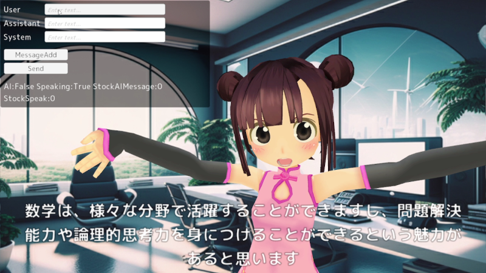

# 概要
 

 
# 必要なもの

* Windows OS (11)
* Unity 2021.3.10f1
* ChatGPT APIKey
* VOICEVOX
 
# 導入手順

## 設定ファイルの作成

Project/AITuberBody/Data/config.txt を作成してください。ひな型となるサンプル(config_sammple.txt)が入っています。

```
OpenAI-APIKey sk-XXXXXXXXXXXXXXXXXXXXXXXXXXXXXXXXXXXXXXXXXXXXXX
VOICEVOX C:\user\app\VOICEVOX\VOICEVOX\VOICEVOX.exe
```

こちらに、ChatGPT(OpenAI)のAPIKeyと、VOICEVOXの実行ファイルパスを設定します。

# 使い方
 
実行すると、いろいろなキャラクターが動作します
 
# Note

各ライセンスについては、アップロード可能なものを利用しています。

+ 3Dアバターは、AvaterShpo(https://booth.pm/ja/items/3787505)により作成したVRMファイルを利用しました。
+ フォントは、M+フォントです。
+ リップシンクは、uLipSyncを利用しています。

# Author

えむげん